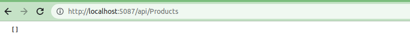
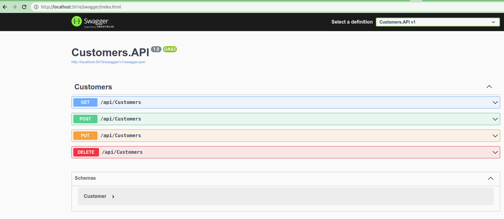
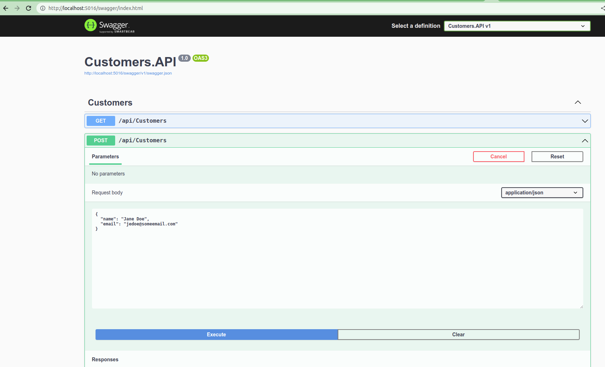

# Microservice Example using .NET and MariaDB

This example enriched (dockerized and docker-compose) the original example here:

- [github repository](https://github.com/mariadb-developers/microservices-dotnet)
- [Readme original](README_original.md)

The file docker-compose contains:
- A service for the mariadb in container and runs the query schema.sql to create the databases (customer_db and product_db) and tables (customers, products).
- The customers API

## Running the example

`docker-compose up`to run the containers (mariadb and the customers api)
```bash
docker-compose up
```
`docker-compose down`to stop and remove the containers (mariadb and the customers api)
```bash
docker-compose down
```

## Testing the application

Open a browser and access the customers application with the url:

http://localhost:5016/api/customers



Initially the response will be empty, but we can execute operations with customers with the help of swagger:

In another tab in the browser, open the swagger UI:

http://localhot:5016/swagger



For example to add a customer to the database:



Back again to the application url, refresh the browser to have the results with the customer added by swagger.

## Access to the database

Also we can access the database by command line:

Execute the command `docker ps` to have the name of the container for the database:

```bash
docker ps
CONTAINER ID   IMAGE        COMMAND                  CREATED         STATUS         PORTS                                       NAMES
5e7be47c8dc5   customers    "dotnet Customers.AP…"   4 minutes ago   Up 4 minutes   0.0.0.0:5016->5016/tcp, :::5016->5016/tcp   dev-example-microservices-dotnet-mariadb_customers_1
adbd9daa5e94   mariadb:10   "docker-entrypoint.s…"   4 minutes ago   Up 4 minutes   0.0.0.0:3307->3306/tcp, :::3307->3306/tcp   dev-example-microservices-dotnet-mariadb_bd_1
```

Get the database IP with the command `docker inspect`
```bash
docker inspect -f '{{range .NetworkSettings.Networks}}{{.IPAddress}}{{end}}' dev-example-microservices-dotnet-mariadb_bd_1 
172.20.0.2
```

Access the database:
```bash
mariadb -h 172.20.0.2 -u root -p
Enter password: 
Welcome to the MariaDB monitor.  Commands end with ; or \g.
Your MariaDB connection id is 3
Server version: 10.10.3-MariaDB-1:10.10.3+maria~ubu2204 mariadb.org binary distribution

Copyright (c) 2000, 2018, Oracle, MariaDB Corporation Ab and others.

Type 'help;' or '\h' for help. Type '\c' to clear the current input statement.
```

The we can execute sql commands like:
- `show databases` to display the databases
  ```bash
  MariaDB [(none)]> show databases;
    +--------------------+
    | Database           |
    +--------------------+
    | customer_db        |
    | information_schema |
    | mysql              |
    | performance_schema |
    | product_db         |
    | sys                |
    +--------------------+
    6 rows in set (0.011 sec)
  ```
- `use <database>` where database could be for example customer_db to access the specified database.
  ```bash
  MariaDB [(none)]> use customer_db
    Reading table information for completion of table and column names
    You can turn off this feature to get a quicker startup with -A

    Database changed
  ```  
- `show tables` to display the table in the selected database:
  ```bash
  MariaDB [customer_db]> show tables;
    +-----------------------+
    | Tables_in_customer_db |
    +-----------------------+
    | customers             |
    +-----------------------+
    1 row in set (0.000 sec)
  ```